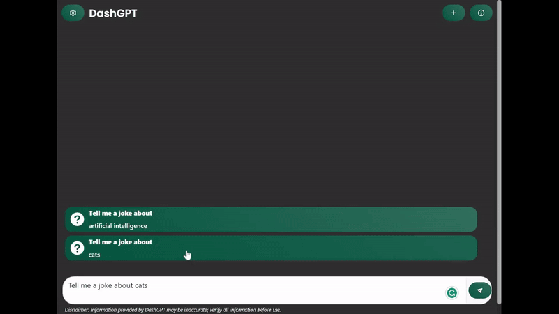

# DashGPT

DashGPT is a template for user-friendly chat interfaces for LLM chat models. It's built with Plotly Dash and provides a seamless experience on both desktop and mobile platforms. This template is setup to use OpenAI's API's but can be adapted to use other LLM's. 

This template supports:  
✨ Retrieval-augmented generation   
💁 User feedback functionality  
⚙️ Custom user settings and user guides  
📡 Text streaming functionality  
📱 Optimized for mobile and desktop  

**Demo Site: https://dashgpt.live**


## Quick Start

1. Clone the repo
2. Create a virtual environment with Python 3.11
3. Install the requirements from `requirements.txt`
4. Fill in the the `.env_TEMPLATE` file and rename it to `.env`
5. Run the app using `python src/dashgpt/app.py`
6. Got to `http://localhost:8050/` in your browser to use it! 

# How it works

## Retrieval Augmented Generation

This repository includes a ChromDB vector database with a sample of 2000 Reddit Jokes embedded. When a question is asked the top 3 most similar jokes to the question are retrieved and used as the context for the LLM. The LLM then generates a response to the question.

In the response the similar jokes are provided in a drop-down accordion element to show how you might display sources of information to the user.

## Plotly Dash Text Streaming

The text streaming functionality was gratefully adapted from [danton267's dash-streaming-GPT-app](https://github.com/danton267/dash-streaming-GPT-app) and built on top of to add functionality. 

From his README on how the text streaming works:

1. User types in the prompt
2. User presses send button
    1. This triggers clientside callback JS function
    2. JS function makes a `await fetch("/streaming-chat"` request to the Dash server
        1. in Dash, we create `@app.server.route("/streaming-chat", methods=["POST"])` route to receive response from the JS function
        2. We retrieve all parameters from the request, process them, and send them to the OpenAI API
        3. We return `Response yield object` to the JS function
    3. JS function processess the response and starts appending incoming text to the `innerHTML` of the `response window element`

There is also a second clientside callback which disables the submit button so that it can not be pressed while the request is being processed.

## Retrieval Augmented Generation: Reddit Jokes

To demonstrate the incorporation of retrieval-augmented generation, we use the Reddit Jokes dataset. The dataset is available here: https://github.com/taivop/joke-dataset/blob/master/reddit_jokes.json

The dataset is loaded into a ChromaDB vector database for local prototyping and demo purposes. You can switch out the Vector DB fairly easily.

## Running the DashGPT App

### Windows

There are two ways, either with standard Plotly Dash call to `app.py` which uses a development server locally. 

```bash
python src/dashgpt/app.py
```

To test a "production" server we need to use `waitress` as `gunicorn` is Linux only. To run the app using `waitress` use the following command:
    
 ```bash
 waitress-serve --listen=localhost:8050 src.dashgpt.app:flask_server
 ```

 ### Linux/Deployment

 For deploying the web app to Azure or running on a Linux VM we can use `gunicorn` which should use the following command:
    
```bash
gunicorn --bind=0.0.0.0 --timeout 600 src.dashgpt.app:flask_server
```

# Contributing

Contributions are welcome! Please read the contributing guidelines before starting.

# Support

If you encounter any issues or have questions, please open an issue.

# License

This project is licensed under the Creative Commons Attribution-Sharealike 4.0 license. See the [LICENSE](LICENSE) file for more details or here: [https://creativecommons.org/licenses/by-sa/4.0/](https://creativecommons.org/licenses/by-sa/4.0/)

# Acknowledgments

- [danton267's dash-streaming-GPT-app](https://github.com/danton267/dash-streaming-GPT-app)
- [Plotly Dash](https://plotly.com/dash/)
- [OpenAI](https://openai.com/)